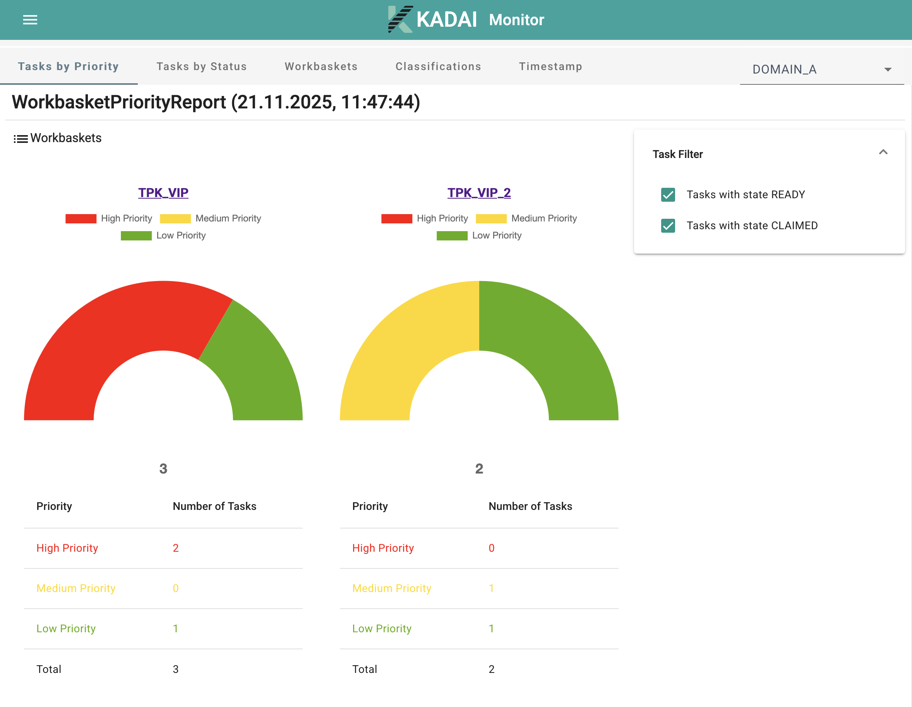
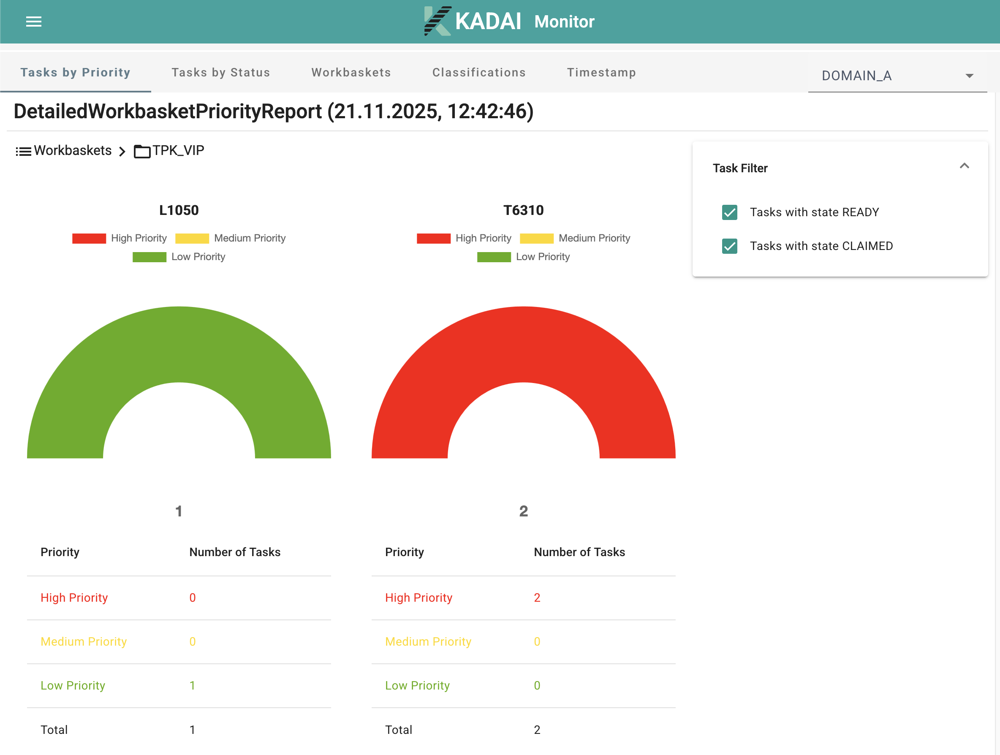

# Monitoring

Monitoring is a real time observation of the current state of work.
It allows viewing and evaluating the status of the team,
thus relevant for team lead to monitor whether all tasks are completed on time.
Monitoring also provides the possibility
to see what work is due in the next few days so that it can be taken into account when staffing.

The data shown by the monitoring includes Tasks and their attributes, like Workbaskets, status, age,
etc. Tasks fulfilling certain criteria are counted
 to create a statistic representing all current Tasks and their attributes.
An example of this can be seen below.


This screenshot shows one of the representations that can be created by the Monitor. It's a table that sums up the number of Tasks by the day of due date and their Workbasket. This table is visualized in the diagram provided by KADAI UI.


There are other options for filtering and aggregating Tasks in the KADAI Monitor.
You can see them in detail
by switching tabs in the [monitoring UI](https://kadai-io.azurewebsites.net/kadai/#/kadai/monitor/tasks-priority) as part of our demo application.
The username and password for the demo application are `admin` and `admin`.


Some data is additionally visualized.
For example, you can see Tasks divided by their status in a pie chart in KADAI UI:


## Task Priority Report

The Task Priority Report in KADAI helps to understand how urgent work is distributed across Workbaskets.
It groups all open Tasks into defined priority ranges and shows how many Tasks fall into each range per Workbasket.

### How It Works

Each row of the report represents a **Workbasket**, and each cell represents a **priority range** (low, medium and high).
The values in the table show how many Tasks fall into the corresponding range.
The report can also be filtered using the monitoring filter panel.
These filters allow focusing on Tasks that match specific criteria such as Workbasket types, Task states, classifications and other attributes.
The report is additionally available as a visual chart for easier interpretation.
You can open this report in the **“Task by Priority”** tab in the demo application.



This is the JSON Response for the example chart above:
```
{
  "meta" : {
    "name" : "WorkbasketPriorityReport",
    "date" : "2025-12-05T15:59:34.389527002Z",
    "header" : [ "3 - 300", "2 - 2", "0 - 1" ],
    "rowDesc" : [ "WORKBASKET" ],
    "sumRowDesc" : "Total"
  },
  "rows" : [ {
    "cells" : [ 2, 0, 1 ],
    "total" : 3,
    "depth" : 0,
    "desc" : [ "TPK_VIP" ],
    "display" : true
  }, {
    "cells" : [ 2, 1, 2 ],
    "total" : 5,
    "depth" : 0,
    "desc" : [ "TPK_VIP_2" ],
    "display" : true
  } ],
  "sumRow" : [ {
    "cells" : [ 4, 1, 3 ],
    "total" : 8,
    "depth" : 0,
    "desc" : [ "Total" ],
    "display" : true
  } ],
  "_links" : {
    "self" : {
      "href" : "https://kadai-io.azurewebsites.net/kadai/api/v1/monitor/workbasket-priority-report?workbasket-type=TOPIC&columnHeader=%5BLio.kadai.monitor.rest.models.PriorityColumnHeaderRepresentationModel%3B%40726aff5f"
    }
  }
}
```

## Detailed Task Priority Report

The Detailed Task Priority Report extends the Task Priority Report by adding a second level of analysis inside each Workbasket.
It not only shows how many Tasks belong to each priority range but also breaks this information down by **Classification**.

### How It Works

The report initially displays the same Workbasket‑based overview found in the standard Task Priority Report.  
Each Workbasket row can then be **expanded** (depth 1) to reveal a detailed breakdown:

- Each **Classification** within the Workbasket is shown as a sub‑row (depth 1).
- Each sub‑row (depth 1) contains the same priority ranges.
- Counts show how many Tasks of that Classification fall into each priority bucket.

### Additional Filters

In addition to all existing monitoring filters, the Detailed Task Priority Report supports:

- **Filtering by Classification keys** – restricts the report to selected Task types  
- **Filtering by Domains** – allows analysis of Tasks belonging to specific domains  

These filters apply to both the high‑level and detailed representations.
Like other monitoring visualizations, the detailed report is also available in both table and chart form.
You can open this report in the **“Task Priority”** tab in the demo application.



This is the JSON Response for the example chart above:
```
{
  "meta" : {
    "name" : "DetailedWorkbasketPriorityReport",
    "date" : "2025-12-05T16:01:09.661213767Z",
    "header" : [ "3 - 300", "2 - 2", "0 - 1" ],
    "rowDesc" : [ "WORKBASKET", "CLASSIFICATION" ],
    "sumRowDesc" : "Total"
  },
  "rows" : [ {
    "cells" : [ 2, 0, 1 ],
    "total" : 3,
    "depth" : 0,
    "desc" : [ "TPK_VIP", null ],
    "display" : true
  }, {
    "cells" : [ 1, 0, 1 ],
    "total" : 2,
    "depth" : 1,
    "desc" : [ "TPK_VIP", "L1050" ],
    "display" : false
  }, {
    "cells" : [ 1, 0, 0 ],
    "total" : 1,
    "depth" : 1,
    "desc" : [ "TPK_VIP", "L1060" ],
    "display" : false
  }, {
    "cells" : [ 2, 1, 2 ],
    "total" : 5,
    "depth" : 0,
    "desc" : [ "TPK_VIP_2", null ],
    "display" : true
  }, {
    "cells" : [ 2, 0, 1 ],
    "total" : 3,
    "depth" : 1,
    "desc" : [ "TPK_VIP_2", "T2000" ],
    "display" : false
  }, {
    "cells" : [ 0, 1, 1 ],
    "total" : 2,
    "depth" : 1,
    "desc" : [ "TPK_VIP_2", "T6310" ],
    "display" : false
  } ],
  "sumRow" : [ {
    "cells" : [ 4, 1, 3 ],
    "total" : 8,
    "depth" : 0,
    "desc" : [ "Total", null ],
    "display" : true
  }, {
    "cells" : [ 1, 0, 1 ],
    "total" : 2,
    "depth" : 1,
    "desc" : [ "Total", "L1050" ],
    "display" : false
  }, {
    "cells" : [ 1, 0, 0 ],
    "total" : 1,
    "depth" : 1,
    "desc" : [ "Total", "L1060" ],
    "display" : false
  }, {
    "cells" : [ 2, 0, 1 ],
    "total" : 3,
    "depth" : 1,
    "desc" : [ "Total", "T2000" ],
    "display" : false
  }, {
    "cells" : [ 0, 1, 1 ],
    "total" : 2,
    "depth" : 1,
    "desc" : [ "Total", "T6310" ],
    "display" : false
  } ],
  "_links" : {
    "self" : {
      "href" : "https://kadai-io.azurewebsites.net/kadai/api/v1/monitor/detailed-workbasket-priority-report?workbasket-type=TOPIC&columnHeader=%5BLio.kadai.monitor.rest.models.PriorityColumnHeaderRepresentationModel%3B%4064df6e8"
    }
  }
}
```
