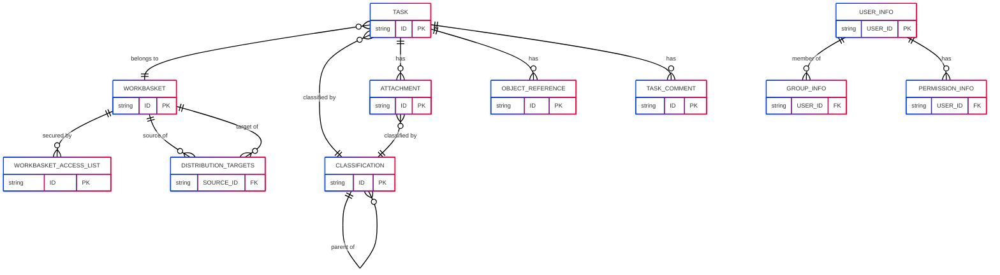
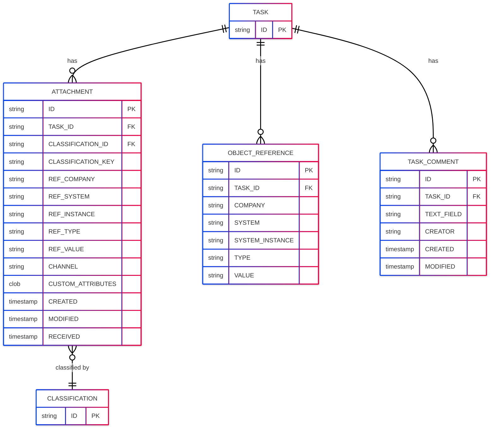
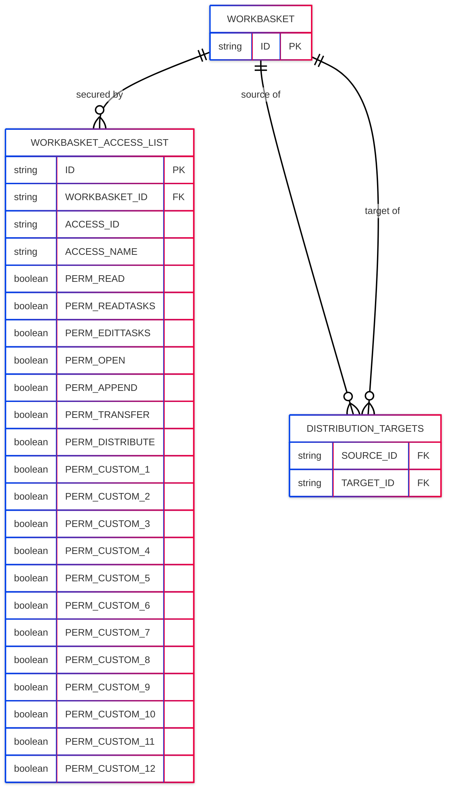
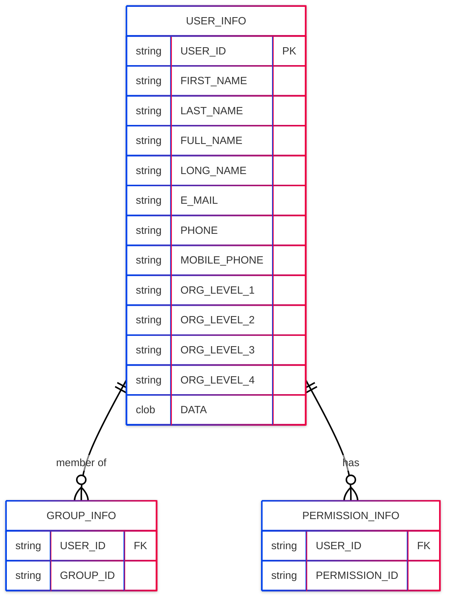
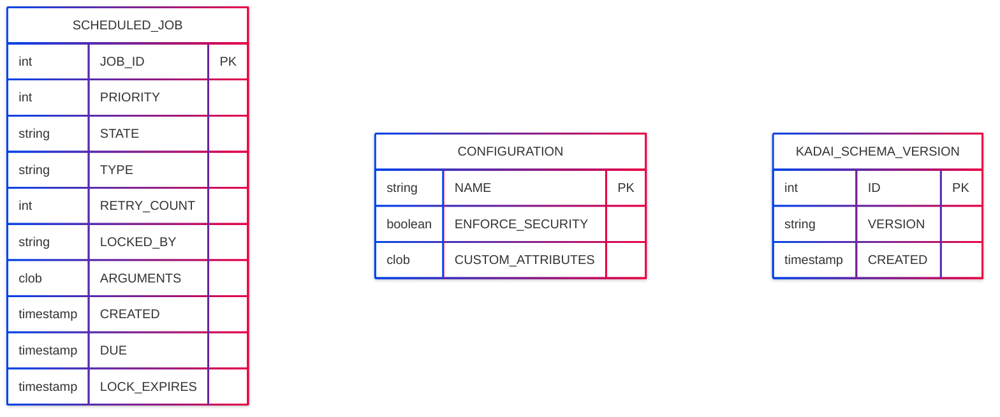
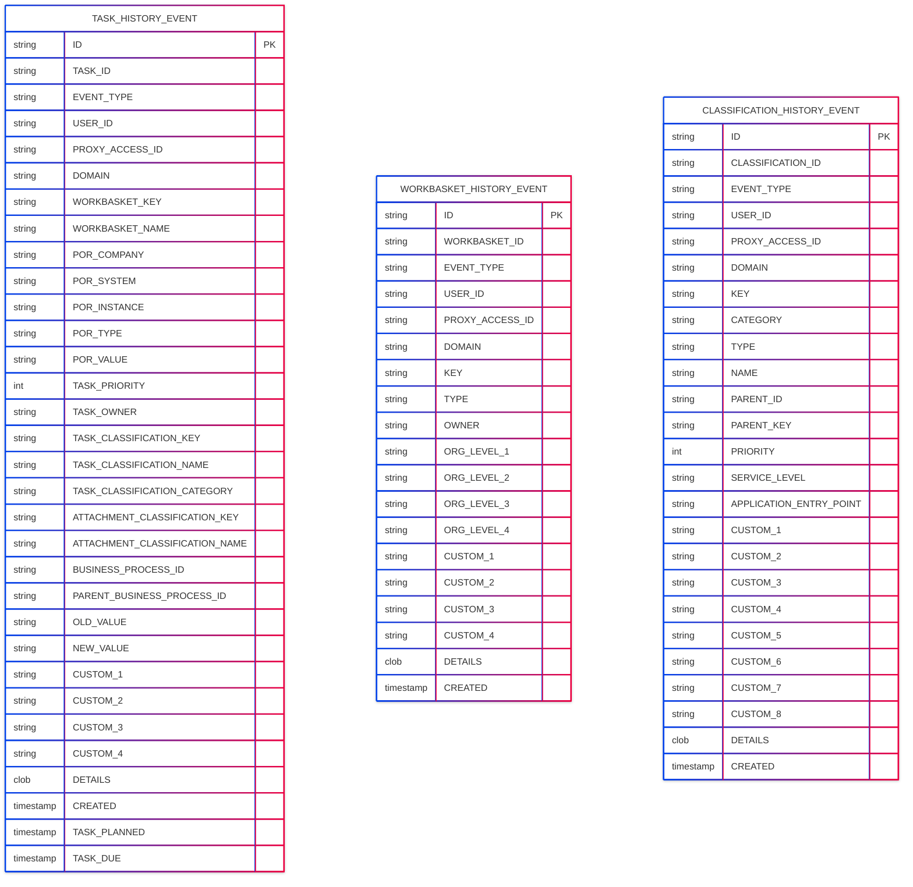

# Data Model

The KADAI data model is built around three core business entities — **Task**, **Workbasket**, and **Classification** — with supporting structures for access control, user management, job scheduling, and audit history.

## Overview

## Core Entities

### Task, Workbasket & Classification

```mermaid
---
config:
  look: neo
  theme: neo
---
erDiagram
    TASK }o--|| WORKBASKET : "belongs to"
    TASK }o--|| CLASSIFICATION : "classified by"
    CLASSIFICATION ||--o{ CLASSIFICATION : "parent of"

    CLASSIFICATION {
        string  ID                      PK
        string  KEY
        string  PARENT_ID               FK
        string  PARENT_KEY
        string  CATEGORY
        string  TYPE
        string  DOMAIN
        boolean VALID_IN_DOMAIN
        string  NAME
        string  DESCRIPTION
        int     PRIORITY
        string  SERVICE_LEVEL
        string  APPLICATION_ENTRY_POINT
        string  CUSTOM_1
        string  CUSTOM_2
        string  CUSTOM_3
        string  CUSTOM_4
        string  CUSTOM_5
        string  CUSTOM_6
        string  CUSTOM_7
        string  CUSTOM_8
        timestamp CREATED
        timestamp MODIFIED
    }

    WORKBASKET {
        string  ID                  PK
        string  KEY
        string  DOMAIN
        string  TYPE
        string  NAME
        string  DESCRIPTION
        string  OWNER
        boolean MARKED_FOR_DELETION
        string  ORG_LEVEL_1
        string  ORG_LEVEL_2
        string  ORG_LEVEL_3
        string  ORG_LEVEL_4
        string  CUSTOM_1
        string  CUSTOM_2
        string  CUSTOM_3
        string  CUSTOM_4
        string  CUSTOM_5
        string  CUSTOM_6
        string  CUSTOM_7
        string  CUSTOM_8
        timestamp CREATED
        timestamp MODIFIED
    }

    TASK {
        string    ID                         PK
        string    EXTERNAL_ID                UK
        string    WORKBASKET_ID              FK
        string    WORKBASKET_KEY
        string    CLASSIFICATION_ID          FK
        string    CLASSIFICATION_KEY
        string    CLASSIFICATION_CATEGORY
        string    DOMAIN
        string    STATE
        int       PRIORITY
        int       MANUAL_PRIORITY
        string    NAME
        string    CREATOR
        string    DESCRIPTION
        string    NOTE
        string    OWNER
        string    BUSINESS_PROCESS_ID
        string    PARENT_BUSINESS_PROCESS_ID
        string    POR_COMPANY
        string    POR_SYSTEM
        string    POR_INSTANCE
        string    POR_TYPE
        string    POR_VALUE
        boolean   IS_READ
        boolean   IS_TRANSFERRED
        boolean   IS_REOPENED
        string    CALLBACK_STATE
        clob      CALLBACK_INFO
        clob      CUSTOM_ATTRIBUTES
        string    CUSTOM_1
        string    CUSTOM_2
        string    CUSTOM_3
        string    CUSTOM_4
        string    CUSTOM_5
        string    CUSTOM_6
        string    CUSTOM_7
        string    CUSTOM_8
        string    CUSTOM_9
        string    CUSTOM_10
        string    CUSTOM_11
        string    CUSTOM_12
        string    CUSTOM_13
        string    CUSTOM_14
        string    CUSTOM_15
        string    CUSTOM_16
        int       CUSTOM_INT_1
        int       CUSTOM_INT_2
        int       CUSTOM_INT_3
        int       CUSTOM_INT_4
        int       CUSTOM_INT_5
        int       CUSTOM_INT_6
        int       CUSTOM_INT_7
        int       CUSTOM_INT_8
        int       NUMBER_OF_COMMENTS
        timestamp CREATED
        timestamp CLAIMED
        timestamp COMPLETED
        timestamp MODIFIED
        timestamp PLANNED
        timestamp DUE
        timestamp RECEIVED
    }
```

### Task Sub-Entities

## Access Control

## User Management

## System & Scheduling

## Audit History

## Entity Descriptions

| Entity | Description |
|---|---|
| **TASK** | The central entity representing a unit of work. Holds all business data including state, priority, owner, timestamps, and up to 16 string and 8 integer custom fields. |
| **WORKBASKET** | A container that organizes Tasks. Can be a personal or group basket. Supports organizational hierarchy via `ORG_LEVEL_*` fields. |
| **CLASSIFICATION** | Hierarchical taxonomy for categorizing Tasks and Attachments. Defines the service level (SLA) and drives priority calculations. |
| **ATTACHMENT** | A secondary object reference attached to a Task, with its own Classification and object reference fields. |
| **OBJECT_REFERENCE** | An additional external-system reference on a Task (beyond the primary object reference embedded in TASK). |
| **TASK_COMMENT** | A user-created note appended to a Task. Deleted automatically when the parent Task is deleted. |
| **WORKBASKET_ACCESS_LIST** | Defines which users or groups can access a Workbasket and which operations they are permitted to perform. |
| **DISTRIBUTION_TARGETS** | Maps a source Workbasket to one or more target Workbaskets for Task distribution. |
| **USER_INFO** | Stores user profile data including contact details and organizational hierarchy levels. |
| **GROUP_INFO** | Maps a user to a group, enabling group-based Workbasket access. |
| **PERMISSION_INFO** | Maps a user to a named permission used for fine-grained access decisions. |
| **SCHEDULED_JOB** | Tracks background jobs (e.g. cleanup, priority recalculation) managed by the KADAI job framework. |
| **CONFIGURATION** | Single-row system configuration record, including the `ENFORCE_SECURITY` flag. |
| **KADAI_SCHEMA_VERSION** | Records the current schema version for migration management. |
| **TASK_HISTORY_EVENT** | Immutable audit log entry for every state change or modification on a Task. |
| **WORKBASKET_HISTORY_EVENT** | Immutable audit log entry for every change to a Workbasket. |
| **CLASSIFICATION_HISTORY_EVENT** | Immutable audit log entry for every change to a Classification. |
